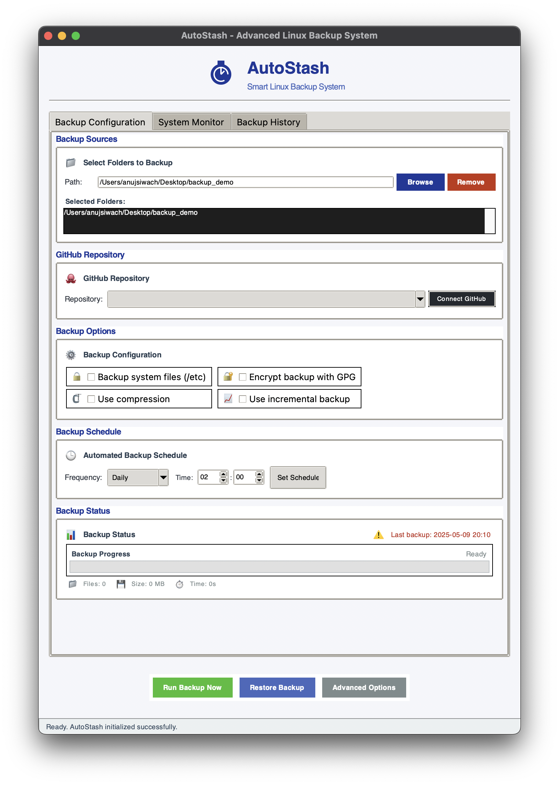
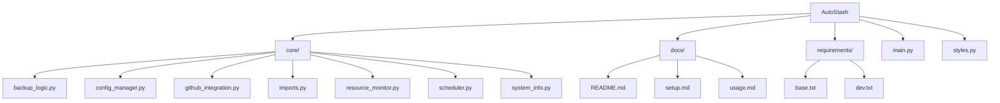
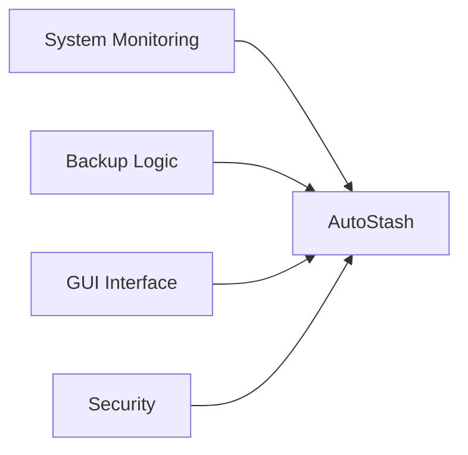
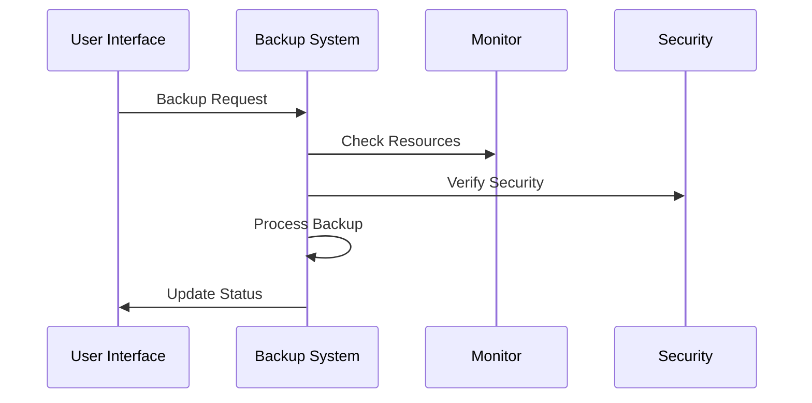

<div align="center">

# 🚀 AutoStash - Linux Backup System


<div>
  <h3>Team Project - Linux System Programming</h3>
  <p>A comprehensive backup solution developed as part of our Linux System Programming course</p>
</div>

</div>


## 👥 Team Members

<div align="center">
  
<table>
<tr>
<td align="center">
  <b>Anuj Kumar</b><br>
  <sub>Backend Development & System Integration</sub>
</td>
<td align="center">
  <b>Anushi</b><br>
  <sub>GUI Development & User Interface</sub>
</td>
</tr>
<tr>
<td align="center">
  <b>Akanksha Mishra</b><br>
  <sub>Backup Logic & Security</sub>
</td>
<td align="center">
  <b>Abhinav Rathee</b><br>
  <sub>System Monitoring & Documentation</sub>
</td>
</tr>
</table>

</div>

## 📋 Project Overview

AutoStash is a Linux backup solution developed as our team project for the Linux System Programming course. It demonstrates our understanding of Linux system programming concepts, including file operations, process management, and system monitoring.

<div align="center">
    

    
</div>

### ✨ Key Features

  
<table>
<tr>
<td width="50%">
  
- 🔒 **Security Features**
  - GPG encryption implementation
  - Secure file handling
  - Access control mechanisms

- ⚡ **System Integration**
  - Resource monitoring
  - Device Specifications 
  - Desktop name

</td>
<td width="50%">

- 📊 **User Interface**
  - Modern GUI using tkinter
  - Real-time system monitoring
  - Intuitive backup management

- 🔄 **Backup Features**
  - Incremental backups
  - GitHub integration
  - Automated scheduling

</td>
</tr>
</table>

## 🏗️ Project Structure



## 🛠️ Technical Implementation

### Core Components



### System Architecture



## 📚 Documentation

- [Setup Guide](docs/setup.md) - Installation and configuration
- [Usage Guide](docs/usage.md) - User manual and features
- [Technical Documentation](docs/technical.md) - Implementation details

## 🎓 Learning Outcomes

This project helped us gain practical experience in:
- Linux system programming
- File system operations
- Process management
- GUI development
- Security implementation
- Team collaboration
- Documentation writing

## 🛠️ Development Setup

### For Developers
```bash
# Clone the repository
git clone https://github.com/Anuj-er/autostash-linux.git
cd autostash

# Create and activate virtual environment
python -m venv .venv
source .venv/bin/activate

# Install development dependencies
pip install -r requirements/dev.txt
```

### Building the Executable
To create a standalone executable that doesn't require Python or dependencies to be installed:

```bash
# Install development dependencies
pip install -r requirements/dev.txt

# Build the executable
python build.py
```

The executable will be created in the `dist` directory. Users can simply run:
```bash
./dist/autostash
```

### For End Users
End users only need to:
1. Download the executable from the releases page
2. Make it executable:
   ```bash
   chmod +x autostash
   ```
3. Run it:
   ```bash
   ./autostash
   ```

## 📝 Project Report

Our detailed project report covers:
- System architecture
- Implementation details
- Testing methodology
- Performance analysis
- Future improvements

## 🤝 Acknowledgments

We would like to thank our course instructor and mentors for their guidance throughout this project.

---

<p>Developed as part of Linux System Programming Course</p>
<p>© 2024 Team AutoStash</p>

